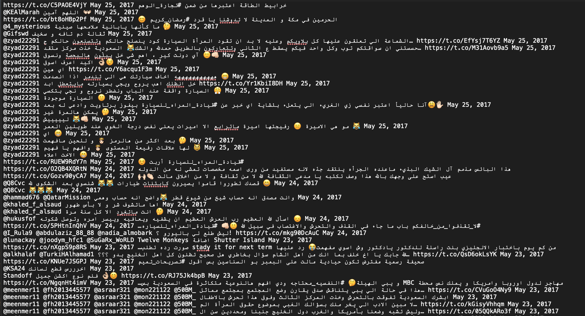
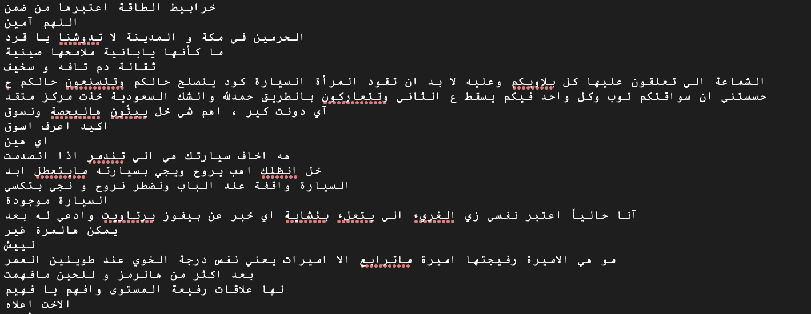
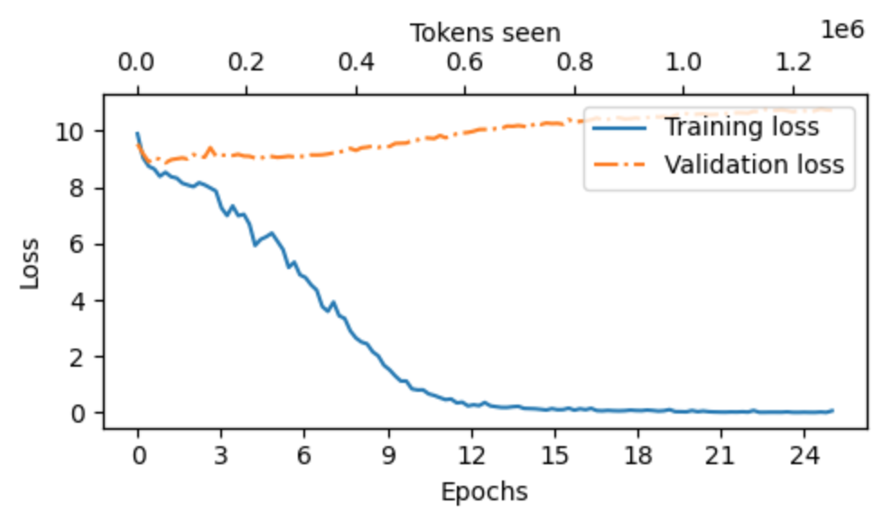
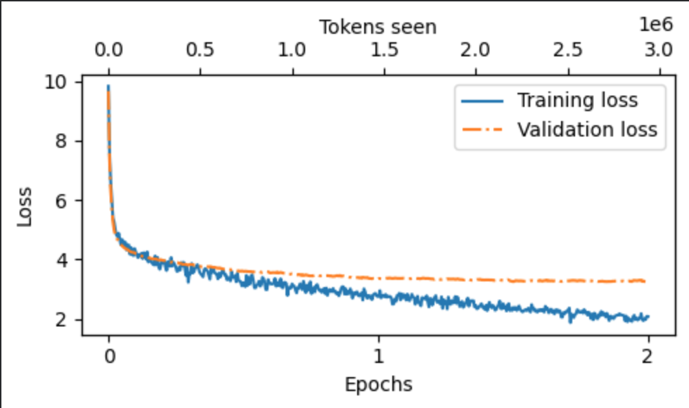

# Saudi-Dialect-GPT
# [The notebook link](https://colab.research.google.com/drive/1Ev5MD5Dl3E6s1rtpjDMcv4TZoatqoiyQ) 
This project includes:
1- Building a GPT2 from scratch

2- Training a GPT2 tokenizer on Saudi raw data (tweets)

3- Applying SFT to the pre-trained model, training it to answer in a Saudi dialect. 

## Contents
1. [Data Preparation](#Data-Preparation)
2. [Toknization](#Toknization)
3. [Training GPT2 form scratch](#Training_GPT2_form_scratch)
4. [Fine Tuning a GPT2 model on our Saudi dataset](#Fine_Tuning_GPT2)
5. [SFT data Preparation](#SFT-data-Preparation)
6. [SFT on the GPT2 model trained form scratch](#SFT-on-the_new_trained-model)
7. [SFT on the GPT2 model pretrained on our data](#SFT-on-the_pre-trained-model)
8. [Evaluation](#Evaluation)
9. [Results](#Results)

## Data Preparation
The dataset used to pre-train the GPT2 model from scratch was Saudi dialect tweets. This dataset was obtained from the [figshare website](https://figshare.com/articles/dataset/Saudi_tweets_dataset/6983006?file=12808310). It is a raw dataset and contains a lot of unwanted characters and symbols as shown in the image. 



### Data pre-processing (cleaning) 
Data pre-processing was applied to clean the data from URLs, mentions, hashtags, emojis, excessive repeating characters, and extra spaces. The following image shows the data after cleaning. 



## Toknization
GPT2 Byte-Pair Toknizer was used and retrained on our dataset.

## Training GPT2 form scratch
A GPT2 was pre-trained from scratch on our dataset. Due to resource limitations, the model was trained for only 25 epochs. The small size of the data led to overfitting, as shown in the graph. Future work: using a pre-trained model and retraining it on our data might give us way better results. 



## SFT data Preparation
In this project, we used the pretrained model and fined-tune it on a conversational dataset from [Hugging Face](https://huggingface.co/datasets/HeshamHaroon/saudi-dialect-conversations). The dataset was in the form of conversations, we manipulated it to convert it to input and output pairs. To keep the history and context of the conversation, we used the input and output of a one conversation line as input to the next line and so on. 

This was the structure of the JSON file: 

```yaml
{"messages": [{"role": "user", "content": "هلا والله يا أبو ناصر، تدري أنا أبي أسجل حقوق الملكية؟"}, {"role": "assistant", "content": "هلا محمد، وش سالفتك بالضبط؟ كيف تبي تسجلها؟"}, {"role": "user", "content": "يقولون فيه نظام جديد من وزارة الإسكان، لازم نسوي كذا وكذا."}, {"role": "assistant", "content": "طيب، تدري وش المطلوب منك؟ الأول تروح لموقع الوزارة الإلكتروني وتدخل معلوماتك."}, {"role": "user", "content": "أدري، بس فيه أوراق لازم أرفقها؟"}, {"role": "assistant", "content": "إيه، لازم ترفق عقد الملكية وصورة البطاقة، وربي ما قصرت بالنصيحة."}, {"role": "user", "content": "الله يعطيك العافية، بروح بنسوي الخطوات المطلوبة قبل نهاية الأسبوع."}], "scenario": "An employee asks their boss about the process of registering property rights with the Ministry of Housing as per the latest government guidelines.", "topic": "government_services", "complexity": "intermediate", "english_summary": "An employee inquires about the process of registering property rights with the Ministry of Housing under new government guidelines."}
{"messages": [{"role": "user", "content": "وش رايك في ذا التلفزيون؟ ودنا نشتري واحد عشان نتابع النهائي."}, {"role": "assistant", "content": "والله زين، شاشته كبيرة ونقاوة الصورة عالية. يسوى الفلوس."}, {"role": "user", "content": "طيب، متى المباراة؟"}, {"role": "assistant", "content": "يقولون يوم الجمعة بعد صلاة العشاء."}, {"role": "user", "content": "يالبى قلبك، بنحجز التلفزيون ونتفرج سوا."}, {"role": "assistant", "content": "خلاص، ابغى اجيب لك واحد قبل ما يخلصون."}], "scenario": "In the Household section at Lulu Hypermarket, two colleagues discuss the best way to watch the upcoming football final on a new television.", "topic": "sports", "complexity": "simple", "english_summary": "Two colleagues discuss buying a new television at Lulu Hypermarket to watch the upcoming football final together."}
{"messages": [{"role": "user", "content": "الطالب: يبه، ودي اروح محل الحيوانات اللي في التحلية ونشتري قطه."}, {"role": "assistant", "content": "المعلم: طيب، بس لازم تحط ميزانية للأكل والرعاية. ماهو بس تشتريها وبس."}, {"role": "user", "content": "الطالب: ابي قطه، تدري وش يحتاجون؟"}, {"role": "assistant", "content": "المعلم: لازم تشتري لها أكل خاص، ورمل للحمام، وألعاب. يعني تكاليفها مو قليل."}, {"role": "user", "content": "الطالب: ايه، والله ما فكرت بهالشي، وش بعد؟"}, {"role": "assistant", "content": "المعلم: بعد لازم تكشف عليها عند الطبيب البيطري كل فترة، علشان صحتها."}, {"role": "user", "content": "الطالب: ما شاء الله، بتطلع غالية، كذا يكفي الميزانية؟"}, {"role": "assistant", "content": "المعلم: ايه، بس إذا خططت صح، تقدر توازن بين المصاريف وتشتري كل شيء لها."}], "scenario": "En route to a pet store in Riyadh, a teacher advises a student on budgeting and considerations for purchasing a pet.", "topic": "shopping", "complexity": "intermediate", "english_summary": "A teacher advises a student on how to budget for pet supplies and what to consider when buying a pet."}
{"messages": [{"role": "user", "content": "وش رايك نروح السوق عند جامع الإمام الشافعي؟ يقولون عندهم سلال حلوة لرمضان."}, {"role": "assistant", "content": "ايه والله فكرة ممتازة. يالبى قلبك، انا ابي سلة تكون فيها تمر وبخور وكذا."}, {"role": "user", "content": "تدري انا سمعت انهم يحطون فيها حلوى وكيك زعفران بعد، وش رايك؟"}, {"role": "assistant", "content": "والله شي طيب، ما شاء الله. خلاص نروح ونشوف وش عندهم."}, {"role": "user", "content": "طيب، بنسوي كذا. متى نطلع؟"}, {"role": "assistant", "content": "بنطلع بعد صلاة العشاء. تسلم، الله يعطيك العافية."}], "scenario": "Choosing the right gift baskets for visitors during Ramadan, available at the marketplace near Imam Ash-Shafii Mosque", "topic": "shopping", "complexity": "intermediate", "english_summary": "Two people discuss visiting a marketplace near Imam Ash-Shafii Mosque to buy gift baskets for Ramadan."}
```

And this is our JSON file after processing: 

```yaml
[
  {
    "input": "هلا والله يا أبو ناصر، تدري أنا أبي أسجل حقوق الملكية؟",
    "output": "هلا محمد، وش سالفتك بالضبط؟ كيف تبي تسجلها؟ <|endoftext|>"
  },
  {
    "input": "هلا والله يا أبو ناصر، تدري أنا أبي أسجل حقوق الملكية؟\nهلا محمد، وش سالفتك بالضبط؟ كيف تبي تسجلها؟\nيقولون فيه نظام جديد من وزارة الإسكان، لازم نسوي كذا وكذا.",
    "output": "طيب، تدري وش المطلوب منك؟ الأول تروح لموقع الوزارة الإلكتروني وتدخل معلوماتك. <|endoftext|>"
  },
  {
    "input": "هلا والله يا أبو ناصر، تدري أنا أبي أسجل حقوق الملكية؟\nهلا محمد، وش سالفتك بالضبط؟ كيف تبي تسجلها؟\nيقولون فيه نظام جديد من وزارة الإسكان، لازم نسوي كذا وكذا.\nطيب، تدري وش المطلوب منك؟ الأول تروح لموقع الوزارة الإلكتروني وتدخل معلوماتك.\nأدري، بس فيه أوراق لازم أرفقها؟",
    "output": "إيه، لازم ترفق عقد الملكية وصورة البطاقة، وربي ما قصرت بالنصيحة. <|endoftext|>"
  },
  {
    "input": "وش رايك في ذا التلفزيون؟ ودنا نشتري واحد عشان نتابع النهائي.",
    "output": "والله زين، شاشته كبيرة ونقاوة الصورة عالية. يسوى الفلوس. <|endoftext|>"
  },
  {
    "input": "وش رايك في ذا التلفزيون؟ ودنا نشتري واحد عشان نتابع النهائي.\nوالله زين، شاشته كبيرة ونقاوة الصورة عالية. يسوى الفلوس.\nطيب، متى المباراة؟",
    "output": "يقولون يوم الجمعة بعد صلاة العشاء. <|endoftext|>"
  },
  {
    "input": "وش رايك في ذا التلفزيون؟ ودنا نشتري واحد عشان نتابع النهائي.\nوالله زين، شاشته كبيرة ونقاوة الصورة عالية. يسوى الفلوس.\nطيب، متى المباراة؟\nيقولون يوم الجمعة بعد صلاة العشاء.\nيالبى قلبك، بنحجز التلفزيون ونتفرج سوا.",
    "output": "خلاص، ابغى اجيب لك واحد قبل ما يخلصون. <|endoftext|>"
  },
  {
    "input": "الطالب: يبه، ودي اروح محل الحيوانات اللي في التحلية ونشتري قطه.",
    "output": "المعلم: طيب، بس لازم تحط ميزانية للأكل والرعاية. ماهو بس تشتريها وبس. <|endoftext|>"
  },
  {
    "input": "الطالب: يبه، ودي اروح محل الحيوانات اللي في التحلية ونشتري قطه.\nالمعلم: طيب، بس لازم تحط ميزانية للأكل والرعاية. ماهو بس تشتريها وبس.\nالطالب: ابي قطه، تدري وش يحتاجون؟",
    "output": "المعلم: لازم تشتري لها أكل خاص، ورمل للحمام، وألعاب. يعني تكاليفها مو قليل. <|endoftext|>"
  },
  {
    "input": "الطالب: يبه، ودي اروح محل الحيوانات اللي في التحلية ونشتري قطه.\nالمعلم: طيب، بس لازم تحط ميزانية للأكل والرعاية. ماهو بس تشتريها وبس.\nالطالب: ابي قطه، تدري وش يحتاجون؟\nالمعلم: لازم تشتري لها أكل خاص، ورمل للحمام، وألعاب. يعني تكاليفها مو قليل.\nالطالب: ايه، والله ما فكرت بهالشي، وش بعد؟",
    "output": "المعلم: بعد لازم تكشف عليها عند الطبيب البيطري كل فترة، علشان صحتها. <|endoftext|>"
  },
  {
    "input": "الطالب: يبه، ودي اروح محل الحيوانات اللي في التحلية ونشتري قطه.\nالمعلم: طيب، بس لازم تحط ميزانية للأكل والرعاية. ماهو بس تشتريها وبس.\nالطالب: ابي قطه، تدري وش يحتاجون؟\nالمعلم: لازم تشتري لها أكل خاص، ورمل للحمام، وألعاب. يعني تكاليفها مو قليل.\nالطالب: ايه، والله ما فكرت بهالشي، وش بعد؟\nالمعلم: بعد لازم تكشف عليها عند الطبيب البيطري كل فترة، علشان صحتها.\nالطالب: ما شاء الله، بتطلع غالية، كذا يكفي الميزانية؟",
    "output": "المعلم: ايه، بس إذا خططت صح، تقدر توازن بين المصاريف وتشتري كل شيء لها. <|endoftext|>"
  },
  {
    "input": "وش رايك نروح السوق عند جامع الإمام الشافعي؟ يقولون عندهم سلال حلوة لرمضان.",
    "output": "ايه والله فكرة ممتازة. يالبى قلبك، انا ابي سلة تكون فيها تمر وبخور وكذا. <|endoftext|>"
  },
  {
    "input": "وش رايك نروح السوق عند جامع الإمام الشافعي؟ يقولون عندهم سلال حلوة لرمضان.\nايه والله فكرة ممتازة. يالبى قلبك، انا ابي سلة تكون فيها تمر وبخور وكذا.\nتدري انا سمعت انهم يحطون فيها حلوى وكيك زعفران بعد، وش رايك؟",
    "output": "والله شي طيب، ما شاء الله. خلاص نروح ونشوف وش عندهم. <|endoftext|>"
  },
  {
    "input": "وش رايك نروح السوق عند جامع الإمام الشافعي؟ يقولون عندهم سلال حلوة لرمضان.\nايه والله فكرة ممتازة. يالبى قلبك، انا ابي سلة تكون فيها تمر وبخور وكذا.\nتدري انا سمعت انهم يحطون فيها حلوى وكيك زعفران بعد، وش رايك؟\nوالله شي طيب، ما شاء الله. خلاص نروح ونشوف وش عندهم.\nطيب، بنسوي كذا. متى نطلع؟",
    "output": "بنطلع بعد صلاة العشاء. تسلم، الله يعطيك العافية. <|endoftext|>"
  }]
```

## SFT on the GPT2 model trained form scratch 

At this stage, we fine-tuned our pretrained GPT2 model. We got better losses with lower overfitting as shown in the graph. 




## Evaluation
After 


